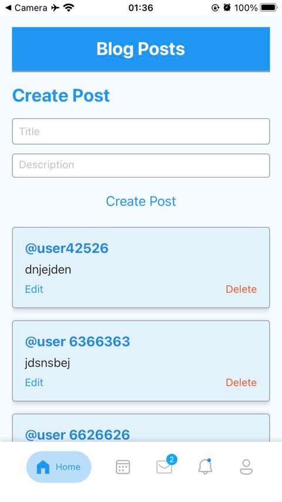
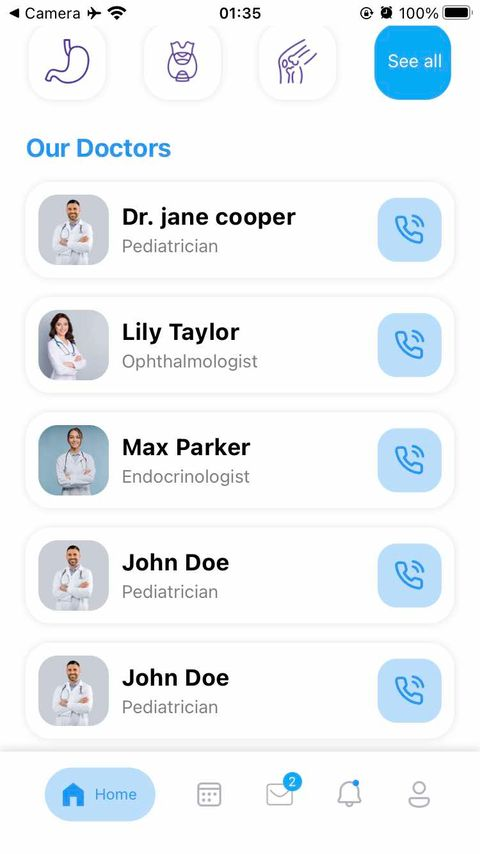
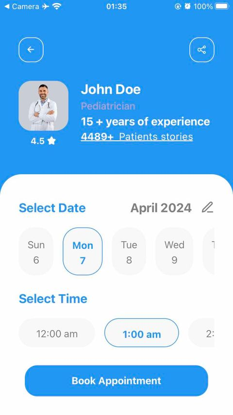
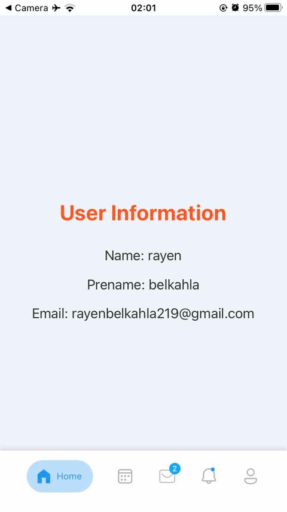
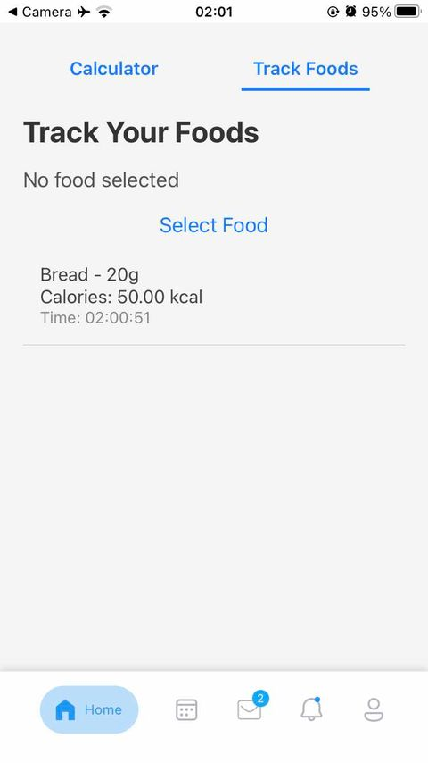
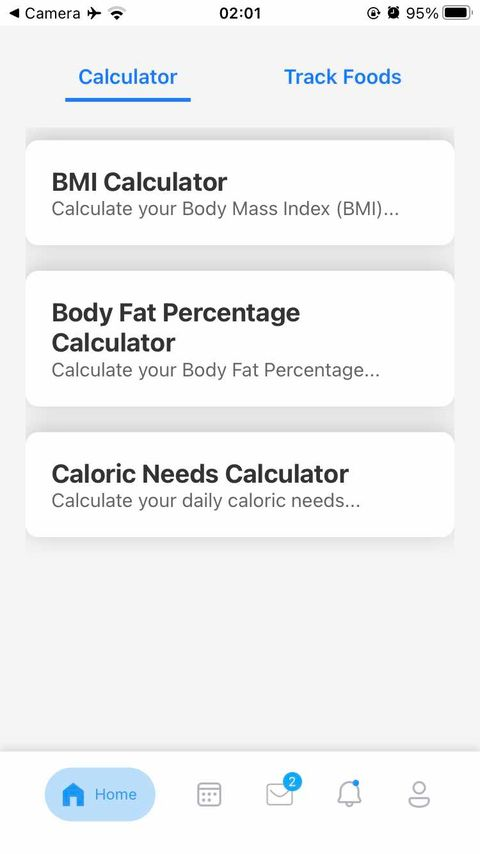
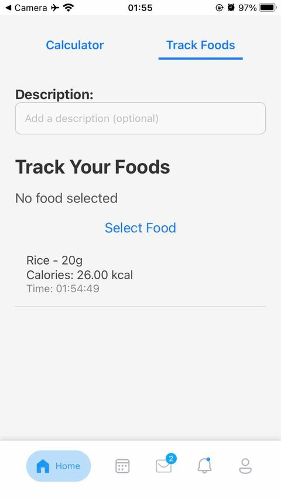

# Doc App

**Doc App** est une application mobile intuitive développée pour promouvoir un mode de vie sain. Conçue avec React Native pour le front-end et une infrastructure backend robuste utilisant Express, Node.js, et MongoDB, cette application combine des fonctionnalités essentielles pour la gestion de la santé et le bien-être.

## Fonctionnalités principales

### Blog Santé :
- Consultez des articles sur des sujets de santé et de bien-être.
- Découvrez des conseils pour maintenir un mode de vie équilibré.

### Suivi des Calories :
- Calculez et suivez votre apport calorique quotidien.
- Obtenez des recommandations basées sur vos besoins nutritionnels.

### Commande de Produits Santé :
- Explorez et commandez des produits pour améliorer votre santé.
- Simplifiez vos achats avec une gestion rapide des commandes.

### Authentification :
- Inscription et connexion sécurisées.
- Gestion des comptes utilisateurs avec une interface fluide.

### Calculatrice :
- Une calculatrice intégrée pour effectuer des calculs rapides liés à vos besoins quotidiens (comme calculer l'indice de masse corporelle ou les ratios caloriques).

## Technologies utilisées

### Frontend :
- **React Native** pour une expérience utilisateur mobile native.

### Backend :
- **Node.js** et **Express** pour une gestion performante des API.

### Base de données :
- **MongoDB** pour organiser les données des utilisateurs, articles, et produits.

---

## Captures d'écran

### Blog Santé

### Suivi des Calories

### Commande de Produits Santé

### Authentification

### Calculatrice

### Interface Utilisateur

